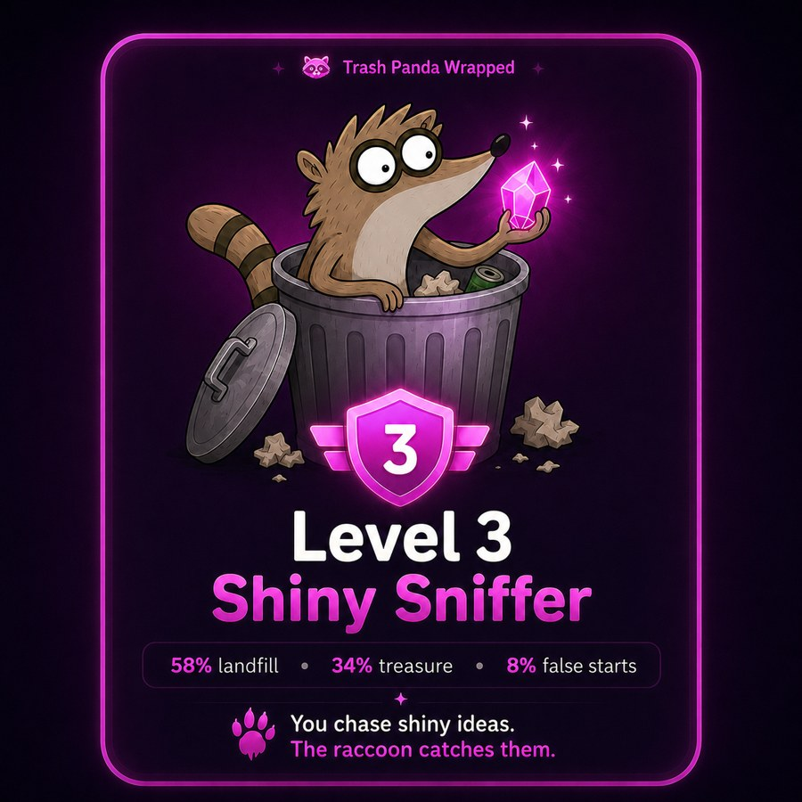
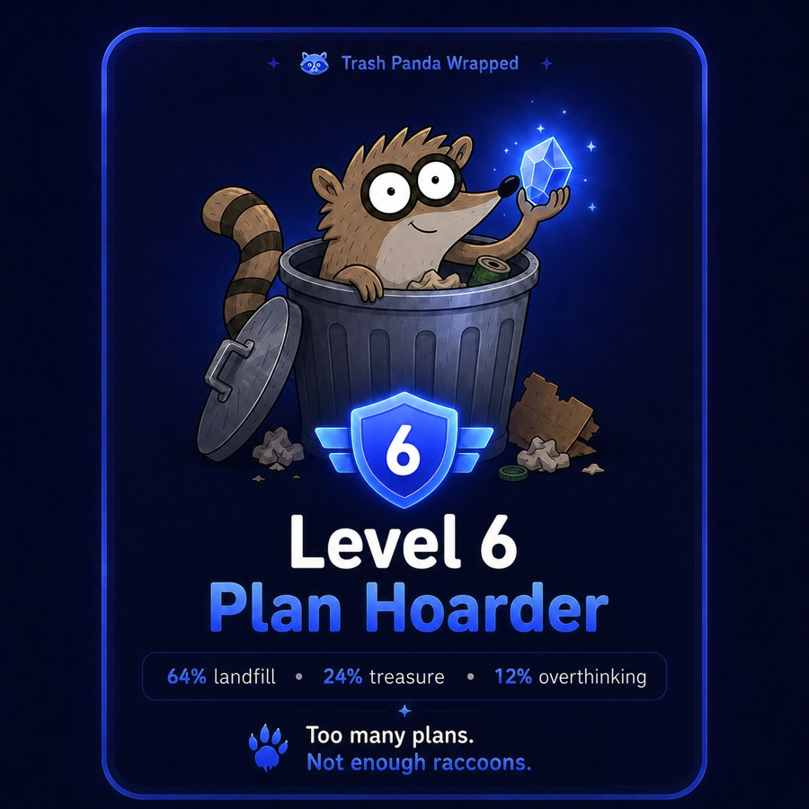
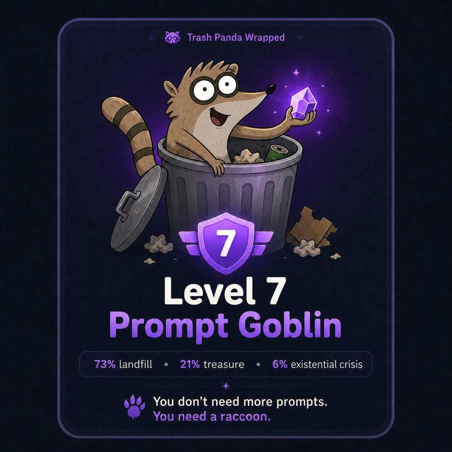
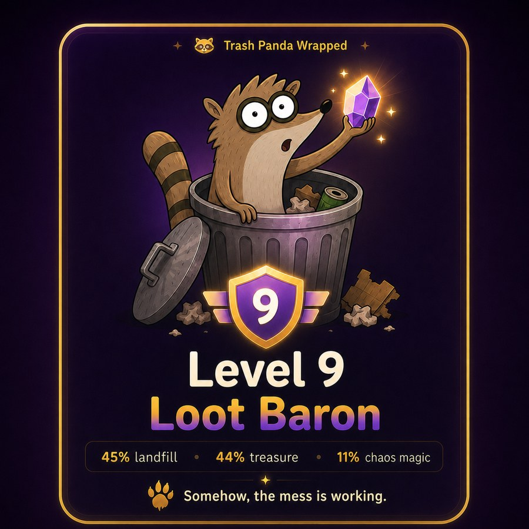

<p align="center">
  
</p>

# 🦝 Trash Panda

> Your AI chats are full of buried treasure. Trash Panda digs it out.

A tiny Claude / ChatGPT skill that rescues forgotten **to-dos, ideas, plans and drafts** from old AI chats into a local markdown `den/`.

`no SaaS` · `no account` · `plain markdown` · `source backlinks` · `Claude + ChatGPT exports`

```bash
/plugin marketplace add mihkarp/trash-panda
/plugin install trash-panda
/dig
```

No SaaS. No account. No "memory layer." Just a raccoon and a folder.

---

## Why?

You talk to Claude and ChatGPT all day.

You generate dozens of to-dos, half-formed ideas, plans, specs, prompts, drafts and follow-ups — and then they die in old chat tabs. You never go back. Next week you re-explain the same project to the AI from scratch.

Trash Panda lives in your agent. Every time you let him loose, he digs through your recent chat history, pulls out the stuff worth keeping, and drags it back to your den — a folder of plain markdown, organized by project, with a link back to the chat each thing came from.

Your chats are trash. Some of it is treasure. Let the raccoon dig.

---

## Example haul

```text
🦝 Dug through 18 chats since last dig.

Found:
📝 5 To Do’s
💎 3 Shiny
🗺️ 1 Plan
📜 2 Loot

Saved to:
- den/projects/trash-panda.md
- den/projects/ai-product-club.md
- den/inbox.md

Last haul: 5 scraps · 3 shiny · 1 plan · 2 loot → den
```

See [`examples/sample-haul.md`](examples/sample-haul.md) and [`examples/sample-den/`](examples/sample-den/) for a full mock den.

---

## The 4 things he drags back

| Artifact | What it rescues | What it looks like |
|---|---|---|
| 📝 **To Do’s** | concrete things you said you’d do | torn checklist note |
| 💎 **Shiny** | ideas worth keeping — “ooh, don’t lose that” | gem fished out of the bin |
| 🗺️ **The Plan** | strategy, route, next steps | crumpled heist map |
| 📜 **Loot** | drafts, specs, prompts, notes | rescued scroll / haul |

Every item links back to the chat it came from. Your loot remembers which bin it crawled out of.

---

## Two ways to dig

### Claude live mode

Use `/dig` inside Claude Code / Cowork. Trash Panda reads recent chats available to the agent and updates your den.

```bash
/dig
```

### ChatGPT / Claude export mode

Export your `conversations.json`, drop it into `den/imports/`, then run:

```bash
/dig export den/imports/conversations.json
```

v0 is honest: ChatGPT uses export mode. Claude gets the sweeter live dig.

See [`docs/chatgpt-export.md`](docs/chatgpt-export.md) for the export flow.

---

## Commands

Two you'll actually use:

- `/dig` — the panda rummages your chats since the last dig, pulls out To Do’s / Shiny / The Plan / Loot, and shows you the haul to approve before anything is written.
- `/den` — show the den: your projects and what's still open. This is your “just let me glance at it.”

The rest of the bench:

- `/sniff` — dry run. Shows what he would find, writes nothing. Good first try.
- `/feed <chat>` — point him at one specific chat: “dig through this one.”
- `/wash` — raccoons wash their food. Tidies the den, collapses duplicates.
- `/nap` — pause auto-digs. He wakes on the next `/dig`.

You can also just talk to him: “hey panda, go dig.”

---

## How it works

```text
your chats → /dig → haul you approve → den/projects/<project>.md → /den
```

1. He reads your chats since the last dig.
2. He pulls out candidates and routes each to a project — matching an existing one, starting a new file, or dropping it in `den/inbox.md` if it doesn't fit anywhere.
3. He shows you the haul. Nothing is written until you approve.
4. Approved items are appended to the right project file — deduped, so the same Shiny never lands twice.
5. The dashboard at `den/index.md` is rebuilt.

The den is just markdown. Open it on GitHub, in VS Code, in Obsidian — wherever. It's yours, and he respects your hand edits.

See [`docs/den-format.md`](docs/den-format.md) for the file structure.

---

## 🏅 Trash Panda Wrapped

Run a one-time dig and get your AI chat archetype.

<p align="center">
  
  
  
  
</p>

Possible diagnoses:

- **Level 3 — Shiny Sniffer**: you chase shiny ideas; the raccoon catches them.
- **Level 6 — Plan Hoarder**: too many plans, not enough raccoons.
- **Level 7 — Prompt Goblin**: you don’t need more prompts; you need a raccoon.
- **Level 9 — Loot Baron**: somehow, the mess is working.

Share your badge with `#TrashPandaWrapped`.

---

## Local-first by default

Trash Panda writes to your local `den/` folder.

Your rescued items are just markdown files.

No SaaS. No account. No dashboard you'll abandon.

If you wire `den/` to GitHub later, that's your choice. The raccoon does not require it.

---

## Privacy & safety

Trash Panda runs inside your existing agent environment and writes to local markdown.

- Export mode works from your local `conversations.json`.
- Nothing is written until you approve the haul.
- Every item keeps a backlink to the source chat.
- There is no separate Trash Panda backend.

See [`docs/privacy.md`](docs/privacy.md).

---

## Roadmap

- [ ] **Trash Panda Wrapped** — shareable AI chat archetype badges
- [ ] **Nightly dig** — wake up to a fresh den
- [ ] **ChatGPT export adapter** — drop `conversations.json`, get a haul
- [ ] **Full Loot** — save actual drafts/specs, not just links
- [ ] **Linear / Notion / GitHub Issues adapters** — for people who live there
- [ ] **Memory bridge** — leave a tiny pointer so future chats already know your den exists

---

## Contributing

Good first ways to help:

- add a new artifact type
- improve project routing rules
- add a den template
- share a sample haul
- improve ChatGPT export parsing
- make the raccoon funnier

See [`CONTRIBUTING.md`](CONTRIBUTING.md).

---

## Why “Trash Panda”?

A raccoon roots through the trash and comes out holding a diamond.

That's the whole product.

Your chat history is the trash. The diamond is everything you said you'd do and then forgot.

Trash Panda does not judge. Trash Panda digs.

---

## License

MIT — see [`LICENSE`](LICENSE). Do whatever you want with him.
