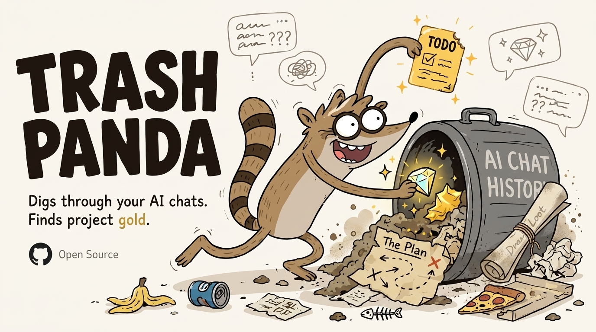

<div align="center">



# Trash Panda

***He digs through your AI chats, keeps the treasure, and files it by project.***

`license MIT` · `works with Claude & ChatGPT` · `your data stays in plain markdown`

</div>

---

You talk to Claude and ChatGPT all day. You generate dozens of to-dos, half-formed ideas, plans, and actual drafts — and they die in old chat tabs. You never go back. You re-explain the same project to the AI next week from scratch.

Trash Panda is a little raccoon that lives in your agent. Every time you let him loose, he **digs** through your recent chat history, pulls out the stuff worth keeping, and drags it back to your **den** — a folder of plain markdown, organized by project, with a link back to the chat each thing came from.

No SaaS. No account. No "memory layer." Just a raccoon and a folder.

---

## The 4 things he drags back

| | What it is | What it looks like |
|---|---|---|
| 📝 **To Do's** | concrete things you said you'd do | a torn note with a checkbox |
| 💎 **Shiny** | an idea worth keeping — *"ooh, don't lose that"* | a gem fished out of the bin |
| 🗺️ **The Plan** | how you're going to do it — the strategy, the route | a crumpled heist map |
| 📜 **Loot** | the stuff you actually made — a draft, a CV, a reading list | the night's haul |

Every item links back to the chat it came from. Your loot remembers which bin it crawled out of.

---

## Install

**Claude (Code / Cowork):**

```
/plugin marketplace add mihkarp/trash-panda
/plugin install trash-panda
```

Or just drop [`skills/trash-panda/SKILL.md`](skills/trash-panda/SKILL.md) into your skills folder.

That's it. The den is a plain `den/` folder next to wherever you're working. Wire it to a GitHub repo later if you want sync — not required.

---

## Commands

Two you'll actually use:

- **`/dig`** — the panda rummages your chats since the last dig, pulls out To Do's / Shiny / The Plan / Loot, and shows you the **haul** to approve before anything is written.
- **`/den`** — show the den: your projects and what's still open. This is your "just let me glance at it."

The rest of the bench:

- **`/sniff`** — dry run. Shows what he *would* find, writes nothing. Good first try.
- **`/feed <chat>`** — point him at one specific chat: *"dig through this one."*
- **`/wash`** — raccoons wash their food. Tidies the den, collapses duplicates.
- **`/nap`** — pause auto-digs. He wakes on the next `/dig`.

You can also just talk to him: *"hey panda, go dig."*

---

## How it works

```
your chats  →  /dig  →  haul (you approve)  →  den/<project>.md  →  /den
```

1. He reads your chats since the last dig.
2. He pulls out candidates and **routes each to a project** — matching an existing one, starting a new file, or dropping it in `den/inbox.md` if it doesn't fit anywhere.
3. He shows you the haul. Nothing is written until you approve.
4. Approved items are **appended** to the right project file — deduped, so the same Shiny never lands twice.
5. The dashboard at `den/index.md` is rebuilt.

The den is just markdown. Open it here on GitHub, in VS Code, in Obsidian — wherever. It's yours, and he respects your hand edits.

See [`den/`](den/) for what a real den looks like.

---

## Roadmap

- 🌙 **Nightly dig** — he works while you sleep, so the den is fresh by morning
- 🔗 **Adapters** — push to Linear / Notion / GitHub Issues for people who live there
- 📜 **Full Loot** — save the actual generated files (the CV, the draft) next to the task list, not just a link
- 🧠 **Memory bridge** — leave a tiny pointer in your AI's memory so future chats already know your den exists

---

## Why "Trash Panda"

A raccoon roots through the trash and comes out holding a diamond. That's the whole product. Your chat history is the trash. The diamond is everything you said you'd do and then forgot.

---

## License

MIT — see [LICENSE](LICENSE). Do whatever you want with him.
